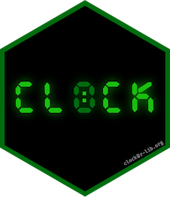

<!-- README.md is generated from README.Rmd. Please edit that file -->

# clock <a href="https://clock.r-lib.org"></a>

<!-- badges: start -->

[](https://app.codecov.io/gh/r-lib/clock?branch=main)
[](https://github.com/r-lib/clock/actions/workflows/R-CMD-check.yaml)

<!-- badges: end -->

clock is an R package for working with date-times. It is packed with
features, including utilities for: parsing, formatting, arithmetic,
rounding, and extraction/updating of individual components. In addition
to these tools for manipulating date-times, clock provides entirely new
date-time types which are structured to reduce the agony of working with
time zones as much as possible. At a high-level, clock:

- Provides a new family of date-time classes (durations, time points,
  zoned-times, and calendars) that partition responsibilities so that
  you only have to think about time zones when you need them.

- Implements a high level API for R’s native date (Date) and date-time
  (POSIXct) classes that lets you get productive quickly without having
  to learn the details of clock’s new date-time types.

- Requires explicit handling of invalid dates (e.g. what date is one
  month after January 31st?) and nonexistent or ambiguous times (caused
  by daylight saving time issues).

- Is built on the C++ [date](https://github.com/HowardHinnant/date)
  library, which provides a correct and high-performance backend.

There are four key classes in clock, inspired by the design of the C++
date and chrono libraries. Some types are more efficient than others at
particular operations, and it is only when all 4 are taken as a whole do
you get a complete date time library.

- A *duration* counts units of time, like “5 years” or “6 nanoseconds”.
  Bigger units are defined in terms of seconds, i.e. 1 day is 86400
  seconds and 1 year is 365.2425 days. Durations are important because
  they form the backbone of clock; it’s relatively rare to use them
  directly.

- A *time point* records an instant in time, like “1:24pm January 1st
  2015”. It combines a *duration* with a “clock” that defines when to
  start counting and what exactly to count. There are two important
  types of time in clock: sys-time and naive-time. They’re equivalent
  until you start working with zoned-times.

- A *zoned-time* is a time point paired with a time zone. You can create
  them from either a sys-time or a naive-time, depending on whether you
  want to convert the time point from UTC (leaving the underlying
  duration unchanged, but changing the printed time), or declare that
  the time point is in a specific time zone (leaving the printed time
  unchanged, but changing the underlying duration). Zoned-times are
  primarily needed for communication with humans.

- A *calendar* represents a date using a combination of fields like
  year-month-day, year-month-weekday, year-quarter-day, year-day, or
  iso-year-week-day, along with hour/minute/second fields to represent
  time within a day (so they’re similar to R’s POSIXlt). Calendar
  objects are extremely efficient at arithmetic involving irregular
  periods such as months, quarters, and years and at getting and setting
  specified components. A calendar can represent invalid dates (like
  2020-02-31) which only need to be resolved when converting back to a
  time point.

## Installation

Install the released version from [CRAN](https://CRAN.R-project.org)
with:

``` r
install.packages("clock")
```

Install the development version from [GitHub](https://github.com/) with:

``` r
# install.packages("pak")
pak::pak("r-lib/clock")
```

## Learning

With clock, there is a high-level API for manipulating R’s native date
and date-time types (Date, POSIXct, and POSIXlt), as well as a low-level
API for more advanced date-time manipulations. The high-level API should
allow you to quickly get productive with clock without having to learn
many of the new types. An easy way to get an overview of this is by
looking at the [High Level
API](https://clock.r-lib.org/reference/index.html#section-high-level-api)
section of the pkgdown reference page.

You’ll also want to take a look at clock’s vignettes:

- [Getting Started](https://clock.r-lib.org/articles/clock.html)

- [Motivations for
  clock](https://clock.r-lib.org/articles/articles/motivations.html)

- [Examples and Recipes](https://clock.r-lib.org/articles/recipes.html)

- [Frequently Asked
  Questions](https://clock.r-lib.org/articles/faq.html)

You can also watch this [5 minute lightning
talk](https://www.rstudio.com/conference/2022/talks/its-about-time/)
about clock:

<p>

<a href="https://www.rstudio.com/conference/2022/talks/its-about-time/?wvideo=pzuyostdz8">
</a>

</p>

## Acknowledgments

The ideas used to build clock have come from a number of places:

- First and foremost, clock depends on and is inspired by the
  [date](https://github.com/HowardHinnant/date) library by Howard
  Hinnant, a variant of which has been voted in to C++20.

- The R “record” types that clock is built on come from
  [vctrs](https://github.com/r-lib/vctrs).

- The [nanotime](https://github.com/eddelbuettel/nanotime) package was
  the first to implement a nanosecond resolution time type for R.

- The [zoo](https://CRAN.R-project.org/package=zoo) package was the
  first to implement year-month and year-quarter types, and has
  functioned as a very successful time series infrastructure package for
  many years.

Additionally, I’d like to thank my wife for being a power user of clock,
and having a number of discussions with me around bugs and missing
features. You can thank her for `date_count_between()`.
